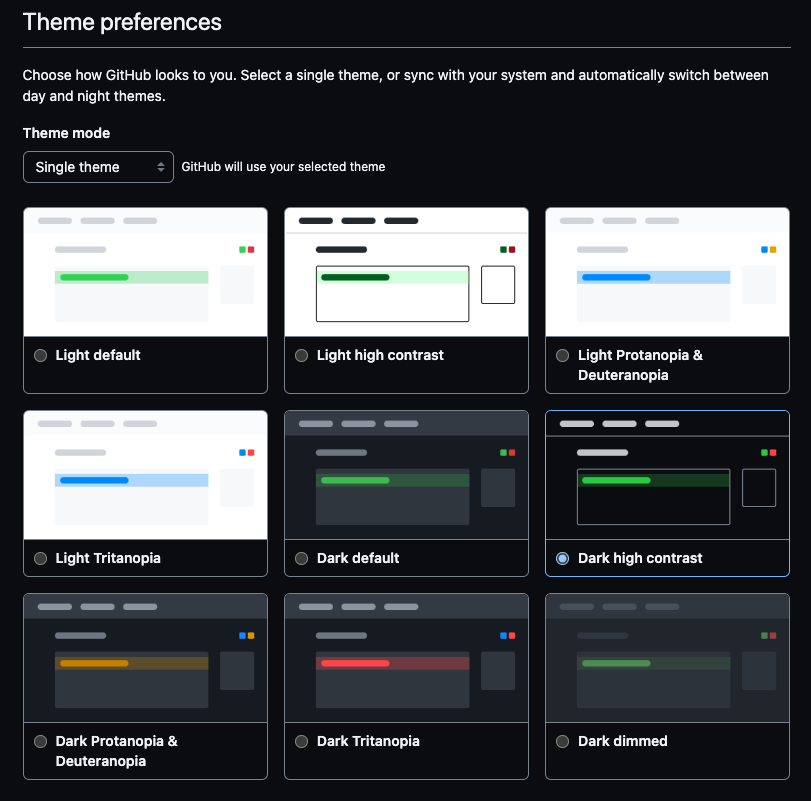

# ✨✨✨ Universe project demo ✨✨✨

DO NOT COPY! This is a demonstration of how **not** to do inclusive content. There are many accessibility issues within this content.

# 💪 Demos of GitHub accessibility features

# 🖼 Themes

[Product docs](https://docs.github.com/en/account-and-profile/setting-up-and-managing-your-personal-account-on-github/managing-personal-account-settings/managing-your-theme-settings)

# 🎥 Animated image player

<!-- original image credit: https://octodex.github.com/images/hula_loop_octodex03.gif -->

[Product docs](https://docs.github.com/en/account-and-profile/setting-up-and-managing-your-personal-account-on-github/managing-personal-account-settings/managing-accessibility-settings#managing-motion)

# 🤔 FAQs

# How do I find out more about accessibility?

EdX has a great course on accessibility. [Click here](https://www.edx.org/course/web-accessibility-introduction).

# Where can I find more information about writing accessible content?

The W3C WAI has many tips on accessibility. [Click here](https://www.w3.org/WAI/tips/writing/).

# Are there tools that you would recommend for accessibility testing?

- Accessibility Insights for Web. [Read more](https://accessibilityinsights.io/docs/web/overview/).
- axe DevTools. [Read more](https://chrome.google.com/webstore/detail/axe-devtools-web-accessib/lhdoppojpmngadmnindnejefpokejbdd).
